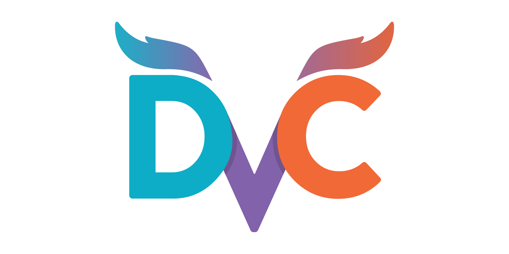
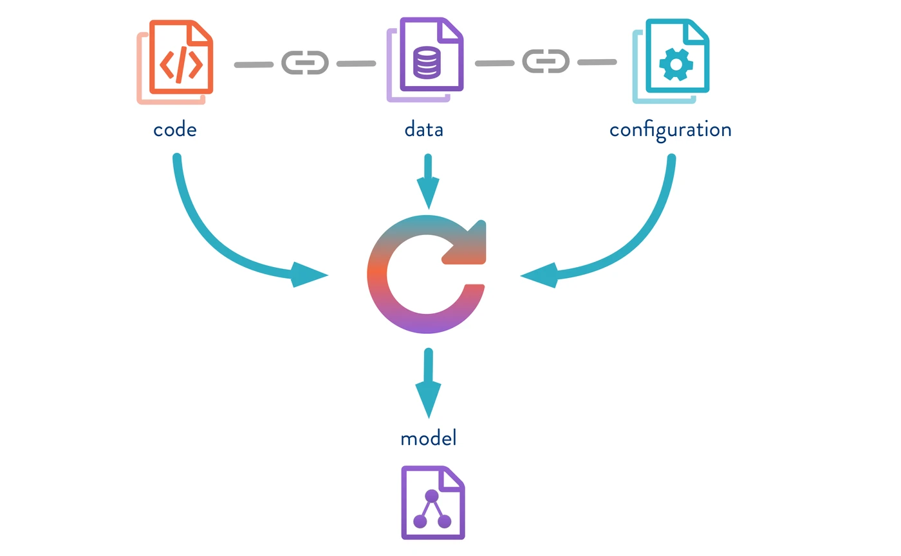
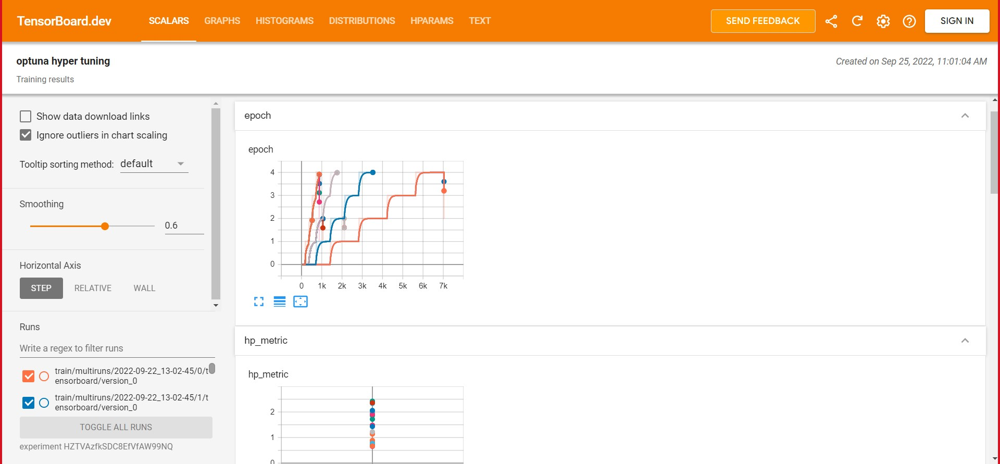
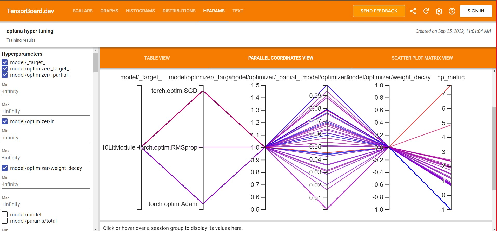

# TOC 
- [TOC](#toc)
- [Assignment](#assignment)
- [solution](#solution)
- [Data Versioning](#data-versioning)
- [Installation](#installation)
- [Hyper Parameters Tuning](#hyper-parameters-tuning)
- [Optuna Optimizer](#optuna-optimizer)
- [Logging in PyTorch Lightning](#logging-in-pytorch-lightning)
- [Tensorboard  Results](#tensorboard--results)

  
# Assignment


1. Add "per step logging" (training step), and log "hp_metric" in tensorboard as validation loss
(https://pytorch-lightning.readthedocs.io/en/stable/api/pytorch_lightning.loggers.tensorboard.html#pytorch_lightning.loggers.tensorboard.TensorBoardLogger.log_hyperparams
2. Do a Hyperparam sweep for CIFAR10 dataset with resnet18 from timm.
3. Find the best batch_size and learning rate, and optimizer
Optimizers have to be one of Adam, SGD, RMSProp
you can use colab for this(docker is not necessary for this). and train on TPUs/GPUs, either is fine. (CPU training will be really SLOW !)
4. Push model, logs and data to google drive (using dvc)
make the folder public and share link of the google drive folder (must be public)
5. Push the pytorch lightning - hydra template with the dvc changes that we made to github
share link to the github repo
6. Upload Tensorboard logs to (https://tensorboard.dev/) and share link to the tensorboard.dev 
(https://colab.research.google.com/github/tensorflow/tensorboard/blob/master/docs/tbdev_getting_started.ipynb#scrollTo=n2PvxhOkW7vn 

# solution
 - Gdrive Link for dvc - https://drive.google.com/drive/folders/1UkPNtm9iSqkrut0bLxv2z4sZrTRh8JjA?usp=sharing

 - Tensorboard Link for dvc -  https://tensorboard.dev/experiment/HZTVAzfkSDC8EfVfAW99NQ/

 - Colab link for Training - https://colab.research.google.com/drive/1VqzN-QSRIP-QUq_ySVe-lnKMcHh2cUaw?usp=sharing

 - Best HyperParameter

 ```
 name: optuna
 best_params:
    model.optimizer._target_: torch.optim.SGD
    model.optimizer.lr: 0.06393579793317737
    datamodule.batch_size: 128
  best_value: 0.798799991607666
 ```


# Data Versioning

Git is not meant to handle binary files in the first place, as their contents are not necessarily incremental (as with text/code) so no "delta saving" either

Git can technically handle arbitrarily large files, BUT it will be very slow in indexing them.

There are solutions like GIT LFS (Large File Storage) and Git Annex (Distributed File Synchronization System)

git-annex works by creating a symlink in your repo that gets committed. The actual data gets stored into a separate backend (S3, rsync, and MANY others). It is written in haskell. Since it uses symlinks, windows users are forced to use annex in a much different manner, which makes the learning curve higher.

In git-lfs pointer files are written. A git-lfs api is used to write the BLOBs to lfs. A special LFS server is required due to this. Git lfs uses filters so you only have to set up lfs once, and again when you want to specify which types of files you want to push to lfs.

See how complicated the above things are? and also its not that simple to use git-annex. git-lfs may be simple to use but requires a custom git server to work (although github supports it, but with some limits)




DVC also makes sure no files are duplicated in your storage based on their content.

DVC Remotes can be

* Amazon S3
* Microsoft Azure Blob Storage
* Google Cloud Storage
* SSH
* HDFS
* HTTP
* Local files and directories outside the workspace

DVC does not require special servers like Git-LFS demands. Any cloud storage like S3, Google Cloud Storage, or even an SSH server can be used as a remote storage (Links to an external site.

# Installation

```
pip install dvc
```

Setting up DVC with your ML Project
```
git init .
dvc init
```
Add data folder for dvc
```
git rm -r --cached 'data'
dvc add data
```
We first have to remove data folder from being tracked by git and then let dvc take care of it
```
git add .
dvc config core.autostage true
```
autostage: if enabled, DVC will automatically stage (git add) DVC files created or modified by DVC commands.

Add a remote
```
dvc remote add gdrive gdrive://1Xg8uBRgr0AgsVlgRpKiSAl4rfGXP7yjD
```
Here the id after gdrive:// is the google drive folder id
```
dvc push -r gdrive
```
This will now push all the files inside data folder to google drive

# Hyper Parameters Tuning

Hyperparameters are the configurable parameters that are external to the model, and whose value cannot be estimated just from the data. These are often estimated by multiple trials or something called as hyper parameter search.

For example batch size, number of hidden layers in the network, optimizer, learning rate are hyper params.

Another example is the number of K in K-nearest neighbours.

[Cifar10 Hyperparameter Configuration](configs/hparams_search/cifar10_optuna.yaml)

# Optuna Optimizer

https://optuna.org/

Optuna is an automatic hyperparameter optimization software framework, particularly designed for machine learning. It features an imperative, define-by-run style user API. Thanks to our define-by-run API, the code written with Optuna enjoys high modularity, and the user of Optuna can dynamically construct the search spaces for the hyperparameters.

Median Pruner: Prune if the trial’s best intermediate result is worse than median of intermediate results of previous trials at the same step


A simple optimization problem:

1. Define objective function to be optimized. Let's minimize (x - 2)^2
2. Suggest hyperparameter values using trial object. Here, a float value of x is suggested from -10 to 10
3. Create a study object and invoke the optimize method over 100 trials
 
 ```python
 import optuna

def objective(trial):
    x = trial.suggest_float('x', -10, 10)
    return (x - 2) ** 2

study = optuna.create_study()
study.optimize(objective, n_trials=100)

study.best_params  # E.g. {'x': 2.002108042}
```
Optuna can be installed with pip. Python 3.6 or newer is supported.

```bash
% pip install optuna
```

<details>
<summary><b>Key Features</b></summary>
Optuna has modern functionalities as follows:

* Lightweight, versatile, and platform agnostic architecture - Handle a wide variety of tasks with a simple installation that has few requirements.

* Pythonic search spaces - Define search spaces using familiar Python syntax including conditionals and loops.

* Efficient optimization algorithms - Adopt state-of-the-art algorithms for sampling hyperparameters and efficiently pruning unpromising trials.

* Easy parallelization - Scale studies to tens or hundreds or workers with little or no changes to the code.

* Quick visualization - Inspect optimization histories from a variety of plotting functions.

</details>

<br>

# Logging in PyTorch Lightning

https://pytorch-lightning.readthedocs.io/en/stable/extensions/logging.html


- CometLogger - Track your parameters, metrics, source code and more using Comet.

- CSVLogger - Log to local file system in yaml and CSV format.

- MLFlowLogger - Log using MLflow.

- NeptuneLogger - Log using Neptune.

- TensorBoardLogger - Log to local file system in TensorBoard format.

- WandbLogger - Log using Weights and Biases.

- [Remote Logging with PyTorch Lightning](https://pytorch-lightning.readthedocs.io/en/stable/common/remote_fs.html)

Add this in your experiment yaml file
```
- override /logger: tensorboard.yaml
```

To Log to multiple logger we can do
```
- override /logger: many_loggers.yaml
```

Now we can see the logs with
```
tensorboard --bind_all --logdir logs/
```

And MLFlow logs with
```
mlflow ui
```

 # Tensorboard  Results 

 https://tensorboard.dev/experiment/HZTVAzfkSDC8EfVfAW99NQ/


 
 
 
