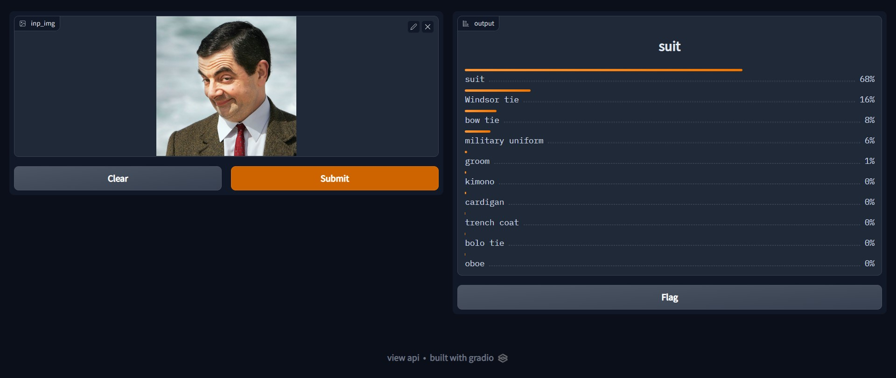
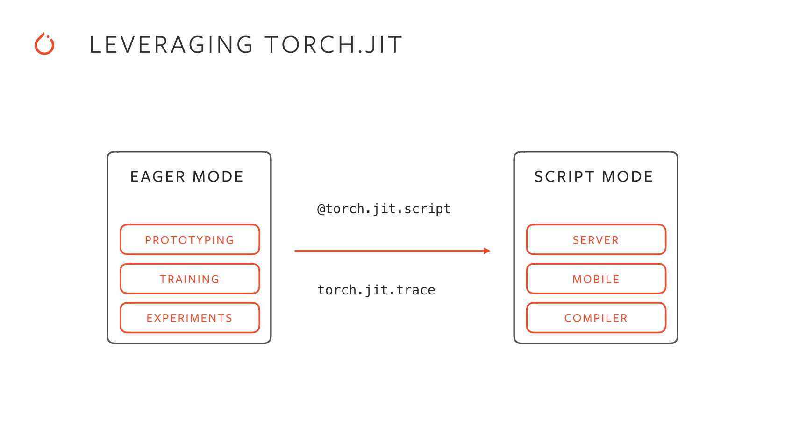
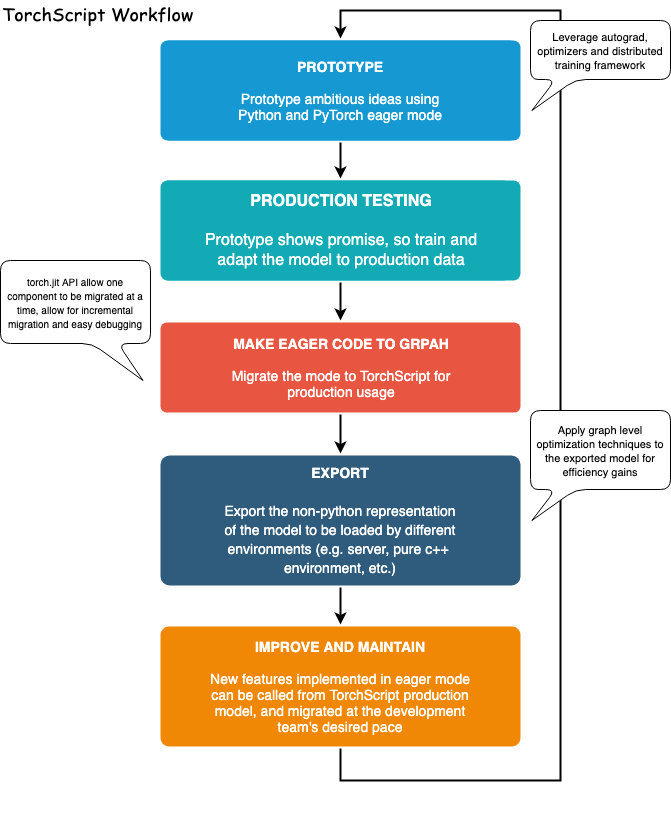
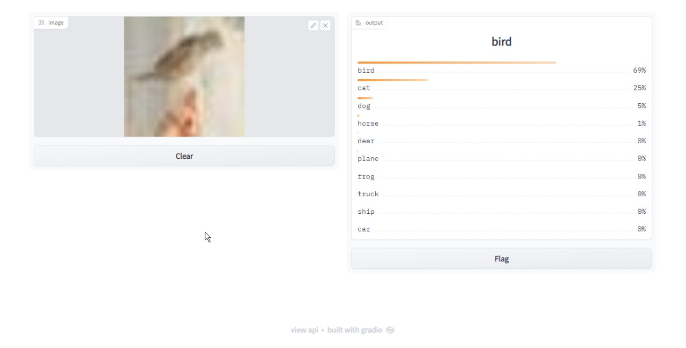
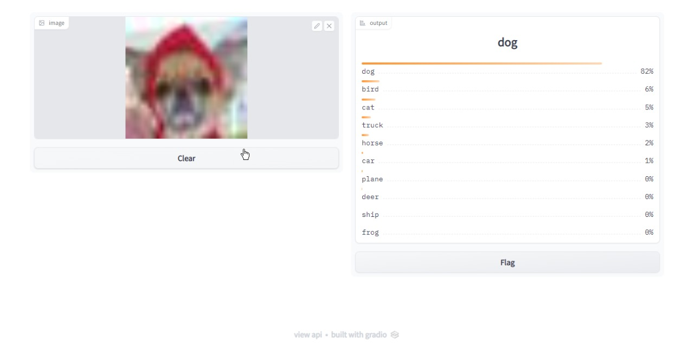

# TOC
- [TOC](#toc)
- [Assignment](#assignment)
- [Gradio Deployment](#gradio-deployment)
- [Streamlit](#streamlit)
- [TorchScript](#torchscript)
- [Docker](#docker)
- [Results from Gradio](#results-from-gradio)

# Assignment
1. Add Demo Deployment for your trained model (scripted checkpoint) in the previous session assignment (CIFAR10 Model)
    - Convert your model to TorchScript Scripted Model
    - It must accept image from user, and give the top 10 predictions
    - Streamlit/Gradio either is fine, it’s up to you.
    - If you are using streamlit, for model output you can use https://docs.streamlit.io/library/api-reference/dataLinks
2. Update README in your repo, write instructions on how to use the demo
3. Dockerize the Demo
    - package the model (scripted only) inside the docker
    - the docker image must be CPU only
    - docker image size limit is 1.2GB (uncompressed)
4. ```docker run -t -p 8080:8080 <image>:<tag>```  should start the webapp !
    - use port 8080 for the webserver
5. Add all the changes to your template repo, share link of the github repository
    - Must include Dockerfile for your demo
6. Push Image to DockerHub and submit link to it

Solution
--------

- storing traced model after training 
    ```python
    traced_model = model.to_torchscript(
        method="trace", example_inputs=torch.randn(1, 32, 32, 3)
    )
    torch.jit.save(
        traced_model, "%s/model.traced.pt" % cfg.callbacks.model_checkpoint.dirpath
    )
    ```
    [demo code with torch trace](src/demo_trace.py)
- run docker image `docker run -p 8080:8080 emlov2:session-04` the final size is *1.19GB*

<br>


# Gradio Deployment


https://gradio.app/quickstart/


Gradio is an open-source Python library that is used to build machine learning and data science demos and web applications.

With Gradio, you can quickly create a beautiful user interface around your machine learning models or data science workflow and let people "try it out" by dragging-and-dropping in their own images, pasting text, recording their own voice, and interacting with your demo, all through the browser.

Gradio is useful for:

- Demoing your machine learning models for clients/collaborators/users/students.

- Deploying your models quickly with automatic shareable links and getting feedback on model performance.

- Debugging your model interactively during development using built-in manipulation and interpretation tools.
  


To get Gradio running, follow these three steps:

1. Install Gradio using pip:
```bash
pip install gradio
```
2. Run the code below as a Python script or in a Jupyter Notebook (or Google Colab):
```python
import gradio as gr
import torch
import requests

from PIL import Image
from torchvision import transforms

model = torch.hub.load('pytorch/vision:v0.6.0', 'resnet18', pretrained=True).eval()

# Download human-readable labels for ImageNet.
response = requests.get("https://git.io/JJkYN")
labels = response.text.split("\n")

def predict(inp):
    inp = transforms.ToTensor()(inp).unsqueeze(0)
    
    with torch.no_grad():
        prediction = torch.nn.functional.softmax(model(inp)[0], dim=0)
        confidences = {labels[i]: float(prediction[i]) for i in range(1000)}    

    return confidences

gr.Interface(fn=predict, inputs=gr.Image(type="pil"), outputs=gr.Label(num_top_classes=3)).launch(share=True)
 ```
3. The demo below will appear automatically within the Jupyter Notebook, or pop in a browser on https://17339.gradio.app/ if running from a script:



# Streamlit

The fastest way to build and share data apps.

Streamlit lets you turn data scripts into shareable web apps in minutes, not weeks. It’s all Python, open-source, and free! And once you’ve created an app you can use our [Community Cloud platform](https://streamlit.io/cloud) to deploy, manage, and share your app!

Core principles of Streamlit:

- Embrace Python scripting: Streamlit apps are just scripts that run from top to bottom. There’s no hidden state. You can factor your code with function calls. If you know how to write Python scripts, you can write Streamlit apps.
- Treat widgets as variables: There are no callbacks in Streamlit. Every interaction simply reruns the script from top to bottom. This approach leads to a clean codebase.
- Reuse data and computation: Streamlit introduces a cache primitive that behaves like a persistent, immutable-by-default data store that lets Streamlit apps safely and effortlessly reuse information.

Installation
```bash
pip install streamlit
streamlit hello
```

# TorchScript

TorchScript is a way to create serializable and optimizable models from PyTorch code. Any TorchScript program can be saved from a Python process and loaded in a process where there is no Python dependency.




TorchScript is a statically typed subset of Python that can either be written directly (using the [@torch.jit.script](https://pytorch.org/docs/stable/generated/torch.jit.script.html#torch.jit.script) decorator) or generated automatically from Python code via tracing. When using tracing, code is automatically converted into this subset of Python by recording only the actual operators on tensors and simply executing and discarding the other surrounding Python code.



# Docker
```docker
# Stage 1: Builder/Compiler
FROM python:3.7-slim-buster AS build

COPY requirements.txt .

# Create the virtual environment.
RUN python3 -m venv /venv
ENV PATH=/venv/bin:$PATH

RUN pip3 install --no-cache-dir -U pip && \
    pip3 install --no-cache-dir -r requirements.txt

# Stage 2: Runtime
FROM python:3.7-slim-buster 

COPY --from=build /venv /venv
ENV PATH=/venv/bin:$PATH
ENV GRADIO_SERVER_PORT 8080

WORKDIR /code

COPY configs/ configs/
COPY checkpoints/model.traced.pt checkpoints/
COPY src/ src/
COPY pyproject.toml .

EXPOSE 8080
ENTRYPOINT ["python3", "src/demo_trace.py"]
```

```
$ docker images
REPOSITORY      TAG             IMAGE ID        CREATED                 SIZE
emlov2          session-04      b95269940802    About a minute ago      1.19GB
```

# Results from Gradio

