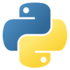

# TOC 
- [TOC](#toc)
- [Assignment](#assignment)
- [Cog: Containers for machine learning](#cog-containers-for-machine-learning)
  - [How it works](#how-it-works)
- [Lightning-Hydra](#lightning-hydra)
  - [📌  Introduction](#introduction)
  - [Main Technologies](#main-technologies)
  - [⚡  Your Superpowers](#your-superpowers)
- [Procedure](#procedure)
  - [Main Config](#main-config)
  - [Experiment Config](#experiment-config)
  - [Assignment workflow](#assignment-workflow)
  - [Outputs](#outputs)

  
# Assignment


1. [Use this template](https://github.com/ashleve/lightning-hydra-template)

2. Add CIFAR10 datamodule (see how MNIST is integrated with the template, and similarly integrate CIFAR10)
3. Refer to this if you need help with CIFAR10 training: https://colab.research.google.com/drive/(1dnc5jVmCLN1UsSL_p4X9UNgE77Y6UpoD?usp=sharing,Links)  (https://juliusruseckas.github.io/ml/lightning.html) (https://pytorch-lightning.readthedocs.io/en/stable/notebooks/lightning_examples/cifar10-baseline.html) see create_model call, and use timm pretrained model there (integrating timm is optional, but gives you bonus points)
 
4. It should include a Makefile for building the docker image, i.e. doing make build on terminal should build the docker image.
5. Include scripts train.py and eval.py for training and eval(metrics) for the model, docker run <image>:<>tag python3 src/train.py experiment=experiment_name.yaml
NOTE: To get the trained model checkpoint and all the logs on the host machine, you'll have to volume mount your lightning-hydra-template directory inside docker. The above command will change slightly for mounting volume.
Include COG into this for inference only (image) (optional)
inference of any pretrained timm model, or the model trained above on a given image.
Push the changes in a repo and share link for it. NOTE: there are github actions included that will run automatically on push.
We’ll continue building on top of this template, and adding more features in to it.

# Cog: Containers for machine learning

**What is Cog?**

* *It is an open-source tool that lets you package machine learning models in a standard, production-ready container. You can deploy your packaged model to your own infrastructure.

* Cog is a tool in the Machine Learning Tools category of a tech stack.

**Cog Integrations**

[](https://stackshare.io/python)
[](https://stackshare.io/docker)
[](https://stackshare.io/redis)
[](https://stackshare.io/python)
[](https://stackshare.io/linux)
[](https://stackshare.io/macos)

**Cog's Features**

* Docker containers without the pain
* No more CUDA hell
* Define the inputs and outputs for your model with  
* standard Python
* Automatic HTTP prediction server
* Automatic queue worker
* Cloud storage
* Ready for production

**Installation**
```
sudo curl -o /usr/local/bin/cog -L https://github.com/replicate/cog/releases/latest/download/cog_`uname -s`_`uname -m`
sudo chmod +x /usr/local/bin/cog
```

## How it works

<details>
<summary><b>Define the Docker environment your model runs in with `cog.yaml`:</b></summary>

```yaml
build:
  python_version: "3.9"
  python_packages:
    - torch==1.12.1
    - torchvision==0.13.1
    - timm==0.6.7
    - click==8.1.3
predict: "infer.py:Predictor"
```
</details>

<details>
<summary><b>Define how predictions are run on your model with `predict.py`:</b></summary>

```python
from cog import BasePredictor, Input, Path
import torch

class Predictor(BasePredictor):
    def setup(self):
        """Load the model into memory to make running multiple predictions efficient"""
        self.model = torch.load("./weights.pth")

    # The arguments and types the model takes as input
    def predict(self,
          image: Path = Input(title="Grayscale input image")
    ) -> Path:
        """Run a single prediction on the model"""
        processed_image = preprocess(image)
        output = self.model(processed_image)
        return postprocess(output)
```


Now, you can run predictions on this model:

```
$ cog predict -i @input.jpg
--> Building Docker image...
--> Running Prediction...
--> Output written to output.jpg
```

Or, build a Docker image for deployment:

```
$ cog build -t my-colorization-model
--> Building Docker image...
--> Built my-colorization-model:latest

$ docker run -d -p 5000:5000 --gpus all my-colorization-model

$ curl http://localhost:5000/predictions -X POST \
    -H 'Content-Type: application/json' \
    -d '{"input": {"image": "https://.../input.jpg"}}'

```
</details>

<br>

# Lightning-Hydra
## 📌  Introduction
**Why you should use it:**

- Convenient all-in-one technology stack for deep learning prototyping - allows you to rapidly iterate over new models, datasets and tasks on different hardware accelerators like CPUs, multi-GPUs or TPUs.
- A collection of best practices for efficient workflow and reproducibility.
- Thoroughly commented - you can use this repo as a reference and educational resource.

**Why you shouldn't use it:**

- Limits you as much as pytorch lightning limits you.
- Lightning and Hydra are still evolving and integrate many libraries, which means sometimes things break - for the list of currently known problems visit [this page](https://github.com/ashleve/lightning-hydra-template/labels/bug).

<br>

## Main Technologies

[PyTorch Lightning](https://github.com/PyTorchLightning/pytorch-lightning) - a lightweight PyTorch wrapper for high-performance AI research. Think of it as a framework for organizing your PyTorch code.

[Hydra](https://github.com/facebookresearch/hydra) - a framework for elegantly configuring complex applications. The key feature is the ability to dynamically create a hierarchical configuration by composition and override it through config files and the command line.

<br>


<br>

## ⚡  Your Superpowers

<details>
<summary><b>Override any config parameter from command line</b></summary>

```bash
python train.py trainer.max_epochs=20 model.optimizer.lr=1e-4
```

> **Note**: You can also add new parameters with `+` sign.

```bash
python train.py +model.new_param="owo"
```

</details>

<details>
<summary><b>Train on CPU, GPU, multi-GPU and TPU</b></summary>

```bash
# train on CPU
python train.py trainer=cpu

# train on 1 GPU
python train.py trainer=gpu

# train on TPU
python train.py +trainer.tpu_cores=8

# train with DDP (Distributed Data Parallel) (4 GPUs)
python train.py trainer=ddp trainer.devices=4

# train with DDP (Distributed Data Parallel) (8 GPUs, 2 nodes)
python train.py trainer=ddp trainer.devices=4 trainer.num_nodes=2

# simulate DDP on CPU processes
python train.py trainer=ddp_sim trainer.devices=2

# accelerate training on mac
python train.py trainer=mps
```

> **Warning**: Currently there are problems with DDP mode, read [this issue](https://github.com/ashleve/lightning-hydra-template/issues/393) to learn more.

</details>

<details>
<summary><b>Train with mixed precision</b></summary>

```bash
# train with pytorch native automatic mixed precision (AMP)
python train.py trainer=gpu +trainer.precision=16
```

</details>

<!-- deepspeed support still in beta
<details>
<summary><b>Optimize large scale models on multiple GPUs with Deepspeed</b></summary>

```bash
python train.py +trainer.
```

</details>
 -->

<details>
<summary><b>Train model with any logger available in PyTorch Lightning, like W&B or Tensorboard</b></summary>

```yaml
# set project and entity names in `configs/logger/wandb`
wandb:
  project: "your_project_name"
  entity: "your_wandb_team_name"
```

```bash
# train model with Weights&Biases (link to wandb dashboard should appear in the terminal)
python train.py logger=wandb
```

> **Note**: Lightning provides convenient integrations with most popular logging frameworks. Learn more [here](#experiment-tracking).

> **Note**: Using wandb requires you to [setup account](https://www.wandb.com/) first. After that just complete the config as below.

> **Note**: Click [here](https://wandb.ai/hobglob/template-dashboard/) to see example wandb dashboard generated with this template.

</details>

<details>
<summary><b>Train model with chosen experiment config</b></summary>

```bash
python train.py experiment=example
```

> **Note**: Experiment configs are placed in [configs/experiment/](configs/experiment/).

</details>

<details>
<summary><b>Attach some callbacks to run</b></summary>

```bash
python train.py callbacks=default
```

> **Note**: Callbacks can be used for things such as as model checkpointing, early stopping and [many more](https://pytorch-lightning.readthedocs.io/en/latest/extensions/callbacks.html#built-in-callbacks).

> **Note**: Callbacks configs are placed in [configs/callbacks/](configs/callbacks/).

</details>

<details>
<summary><b>Use different tricks available in Pytorch Lightning</b></summary>

```yaml
# gradient clipping may be enabled to avoid exploding gradients
python train.py +trainer.gradient_clip_val=0.5

# run validation loop 4 times during a training epoch
python train.py +trainer.val_check_interval=0.25

# accumulate gradients
python train.py +trainer.accumulate_grad_batches=10

# terminate training after 12 hours
python train.py +trainer.max_time="00:12:00:00"
```

> **Note**: PyTorch Lightning provides about [40+ useful trainer flags](https://pytorch-lightning.readthedocs.io/en/latest/common/trainer.html#trainer-flags).

</details>

<details>
<summary><b>Easily debug</b></summary>

```bash
# runs 1 epoch in default debugging mode
# changes logging directory to `logs/debugs/...`
# sets level of all command line loggers to 'DEBUG'
# enforces debug-friendly configuration
python train.py debug=default

# run 1 train, val and test loop, using only 1 batch
python train.py debug=fdr

# print execution time profiling
python train.py debug=profiler

# try overfitting to 1 batch
python train.py debug=overfit

# raise exception if there are any numerical anomalies in tensors, like NaN or +/-inf
python train.py +trainer.detect_anomaly=true

# log second gradient norm of the model
python train.py +trainer.track_grad_norm=2

# use only 20% of the data
python train.py +trainer.limit_train_batches=0.2 \
+trainer.limit_val_batches=0.2 +trainer.limit_test_batches=0.2
```

> **Note**: Visit [configs/debug/](configs/debug/) for different debugging configs.

</details>

<details>
<summary><b>Resume training from checkpoint</b></summary>

```yaml
python train.py ckpt_path="/path/to/ckpt/name.ckpt"
```

> **Note**: Checkpoint can be either path or URL.

> **Note**: Currently loading ckpt doesn't resume logger experiment, but it will be supported in future Lightning release.

</details>

<details>
<summary><b>Evaluate checkpoint on test dataset</b></summary>

```yaml
python eval.py ckpt_path="/path/to/ckpt/name.ckpt"
```

> **Note**: Checkpoint can be either path or URL.

</details>

<details>
<summary><b>Create a sweep over hyperparameters</b></summary>

```bash
# this will run 6 experiments one after the other,
# each with different combination of batch_size and learning rate
python train.py -m datamodule.batch_size=32,64,128 model.lr=0.001,0.0005
```

> **Note**: Hydra composes configs lazily at job launch time. If you change code or configs after launching a job/sweep, the final composed configs might be impacted.

</details>

<details>
<summary><b>Create a sweep over hyperparameters with Optuna</b></summary>

```bash
# this will run hyperparameter search defined in `configs/hparams_search/mnist_optuna.yaml`
# over chosen experiment config
python train.py -m hparams_search=mnist_optuna experiment=example
```

> **Note**: Using [Optuna Sweeper](https://hydra.cc/docs/next/plugins/optuna_sweeper) doesn't require you to add any boilerplate to your code, everything is defined in a [single config file](configs/hparams_search/mnist_optuna.yaml).

> **Warning**: Optuna sweeps are not failure-resistant (if one job crashes then the whole sweep crashes).

</details>

<details>
<summary><b>Execute all experiments from folder</b></summary>

```bash
python train.py -m 'experiment=glob(*)'
```

> **Note**: Hydra provides special syntax for controlling behavior of multiruns. Learn more [here](https://hydra.cc/docs/next/tutorials/basic/running_your_app/multi-run). The command above executes all experiments from [configs/experiment/](configs/experiment/).

</details>

<details>
<summary><b>Execute run for multiple different seeds</b></summary>

```bash
python train.py -m seed=1,2,3,4,5 trainer.deterministic=True logger=csv tags=["benchmark"]
```

> **Note**: `trainer.deterministic=True` makes pytorch more deterministic but impacts the performance.

</details>

<details>
<summary><b>Execute sweep on a remote AWS cluster</b></summary>

> **Note**: This should be achievable with simple config using [Ray AWS launcher for Hydra](https://hydra.cc/docs/next/plugins/ray_launcher). Example is not implemented in this template.

</details>

<!-- <details>
<summary><b>Execute sweep on a SLURM cluster</b></summary>

> This should be achievable with either [the right lightning trainer flags](https://pytorch-lightning.readthedocs.io/en/latest/clouds/cluster.html?highlight=SLURM#slurm-managed-cluster) or simple config using [Submitit launcher for Hydra](https://hydra.cc/docs/plugins/submitit_launcher). Example is not yet implemented in this template.

</details> -->

<details>
<summary><b>Use Hydra tab completion</b></summary>

> **Note**: Hydra allows you to autocomplete config argument overrides in shell as you write them, by pressing `tab` key. Read the [docs](https://hydra.cc/docs/tutorials/basic/running_your_app/tab_completion).

</details>

<details>
<summary><b>Apply pre-commit hooks</b></summary>

```bash
pre-commit run -a
```

> **Note**: Apply pre-commit hooks to do things like auto-formatting code and configs, performing code analysis or removing output from jupyter notebooks. See [# Best Practices](#best-practices) for more.

</details>

<details>
<summary><b>Run tests</b></summary>

```bash
# run all tests
pytest

# run tests from specific file
pytest tests/test_train.py

# run all tests except the ones marked as slow
pytest -k "not slow"
```

</details>

<details>
<summary><b>Use tags</b></summary>

Each experiment should be tagged in order to easily filter them across files or in logger UI:

```bash
python train.py tags=["mnist", "experiment_X"]
```

If no tags are provided, you will be asked to input them from command line:

```bash
>>> python train.py tags=[]
[2022-07-11 15:40:09,358][src.utils.utils][INFO] - Enforcing tags! <cfg.extras.enforce_tags=True>
[2022-07-11 15:40:09,359][src.utils.rich_utils][WARNING] - No tags provided in config. Prompting user to input tags...
Enter a list of comma separated tags (dev):
```

If no tags are provided for multirun, an error will be raised:

```bash
>>> python train.py -m +x=1,2,3 tags=[]
ValueError: Specify tags before launching a multirun!
```

> **Note**: Appending lists from command line is currently not supported in hydra :(

</details>

<br>

# Procedure

All PyTorch Lightning modules are dynamically instantiated from module paths specified in config. Example model config:

```yaml
_target_: src.models.cifar10_module.CIFAR10LitModule

optimizer:
  _target_: torch.optim.Adam
  _partial_: true
  lr: 0.001
  weight_decay: 0.0

model: "resnet18"
```

## Main Config

Location: [configs/train.yaml](configs/train.yaml) <br>
Main project config contains default training configuration.<br>
It determines how config is composed when simply executing command `python src/train.py`.<br>

<details>
<summary><b>Show main project config</b></summary>

```yaml
# @package _global_

# specify here default configuration
# order of defaults determines the order in which configs override each other
defaults:
  - _self_
  - datamodule: cifar10.yaml
  - model: cifar10.yaml
  - callbacks: default.yaml
  - logger: null # set logger here or use command line (e.g. `python train.py logger=tensorboard`)
  - trainer: default.yaml
  - paths: default.yaml
  - extras: default.yaml
  - hydra: default.yaml

  # experiment configs allow for version control of specific hyperparameters
  # e.g. best hyperparameters for given model and datamodule
  - experiment: null

  # config for hyperparameter optimization
  - hparams_search: null

  # optional local config for machine/user specific settings
  # it's optional since it doesn't need to exist and is excluded from version control
  - optional local: default.yaml

  # debugging config (enable through command line, e.g. `python train.py debug=default)
  - debug: null

# task name, determines output directory path
task_name: "train"

# tags to help you identify your experiments
# you can overwrite this in experiment configs
# overwrite from command line with `python train.py tags="[first_tag, second_tag]"`
# appending lists from command line is currently not supported :(
# https://github.com/facebookresearch/hydra/issues/1547
tags: ["dev"]

# set False to skip model training
train: True

# evaluate on test set, using best model weights achieved during training
# lightning chooses best weights based on the metric specified in checkpoint callback
test: True

# simply provide checkpoint path to resume training
ckpt_path: null

# seed for random number generators in pytorch, numpy and python.random
seed: null
```
</details>

<br>

## Experiment Config

Location: [configs/experiment/example_train.yaml](configs/experiment/example_train.yaml)<br>
Experiment configs allow you to overwrite parameters from main config.<br>
For example, you can use them to version control best hyperparameters for each combination of model and dataset.

<details>
<summary><b>show example summary config</b></summary>

```yaml
# @package _global_

# to execute this experiment run:
# python train.py experiment=example

defaults:
  - override /datamodule: cifar10.yaml
  - override /model: cifar10.yaml
  - override /callbacks: default.yaml
  - override /trainer: default.yaml

# all parameters below will be merged with parameters from default configurations set above
# this allows you to overwrite only specified parameters

seed: 12345

trainer:
  min_epochs: 1
  max_epochs: 1
  gradient_clip_val: 0.5

model:
  optimizer:
    lr: 0.002
  model: "resnet18"
  

datamodule:
  batch_size: 64
  ```
  </details>

  <br>


## Assignment workflow

1. You can see PyTorch Lightning module from below link. [models/mnist_module.py](src/models/cifar10_module.py). For config file refer this link [model/cifar10.yaml](configs/model/cifar10.yaml).
2. You can see PyTorch Lightning datamodule from below link. [datamodules/cifar10_datamodule.py](src/datamodules/cifar10_datamodule.py). For config file refer this link [configs/datamodule/cifar10.yaml](configs/datamodule/cifar10.yaml)
3. Run `make build` for building docker container.
4. Run training with chosen experiment config:
   ```bash
   dcoker run emlov2:session-02 python3 src/train.py # will select main cofig file
   docker run emlov2:session-02 python3 src/train.py experiment=example_train.yaml # to run specific project
   ```
   or simply execute to run experiment 
   ```bash
   make train
   ```

5. Run eval
   
    ```bash
    docker run emlov2:session-02 python3 src/eval.py
    ```
    or simpy execute 
    ```bash
    make eval
    ```


## Outputs

- Train

  ```bash
  Epoch 0    ━━━━━━━━━━━━━━━━ 783/783 0:16:22 • 0:00:00 4.03it/s loss: 0.957      
                                                                val/acc: 0.688   
                                                                val/acc_best:    
                                                                0.688 train/acc: 
                                                                0.589            
  Starting testing!
  Files already downloaded and verified
  Files already downloaded and verified
  ┏━━━━━━━━━━━━━━━━━━━━━━━━━━━┳━━━━━━━━━━━━━━━━━━━━━━━━━━━┓
  ┃        Test metric        ┃       DataLoader 0        ┃
  ┡━━━━━━━━━━━━━━━━━━━━━━━━━━━╇━━━━━━━━━━━━━━━━━━━━━━━━━━━┩
  │         test/acc          │    0.6866000294685364     │
  │         test/loss         │    0.9233477711677551     │
  └───────────────────────────┴───────────────────────────┘
  Testing ━━━━━━━━━━━━━━━━━━━━━━━━━━━━━━━━━━ 157/157 0:00:06 • 0:00:00 24.83it/s 

  Best ckpt path: /code/checkpoints/epoch_000-v1.ckpt
  Closing loggers..
  Output dir: /code/logs/train/runs/2022-09-10_10-37-13
  Metric name is None! Skipping metric value retrieval...
  ```

- Eval

  ```bash
  Testing DataLoader 0: 100%|██████████| 79/79 [00:05<00:00, 14.60it/s]
  ┏━━━━━━━━━━━━━━━━━━━━━━━━━━━┳━━━━━━━━━━━━━━━━━━━━━━━━━━━┓
  ┃        Test metric        ┃       DataLoader 0        ┃
  ┡━━━━━━━━━━━━━━━━━━━━━━━━━━━╇━━━━━━━━━━━━━━━━━━━━━━━━━━━┩
  │         test/acc          │    0.6747999787330627     │
  │         test/loss         │    0.9841547608375549     │
  └───────────────────────────┴───────────────────────────┘
  Closing loggers...
  Output dir: /code/logs/eval/runs/2022-09-10_11-09-49

  ```

  <br>

    
  