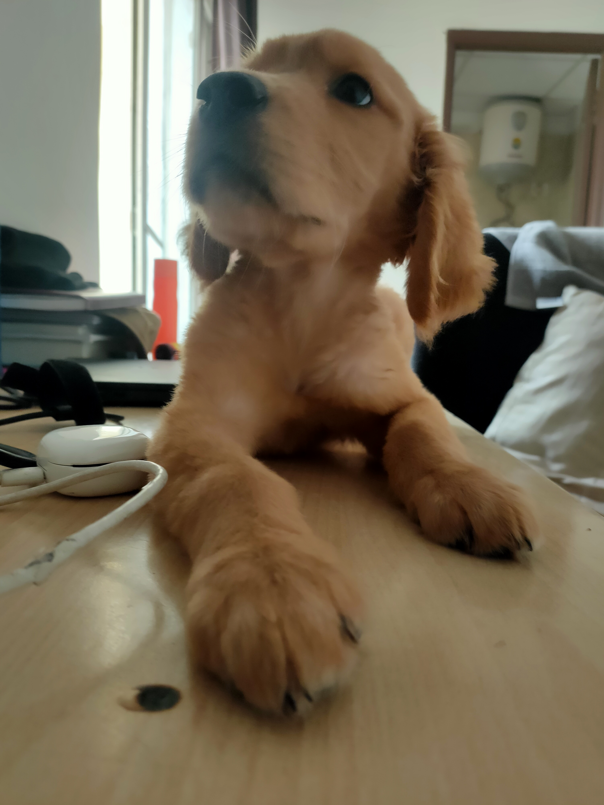
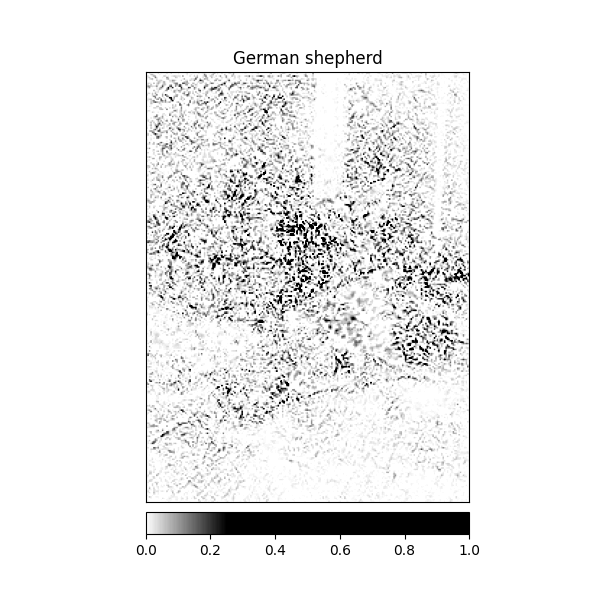
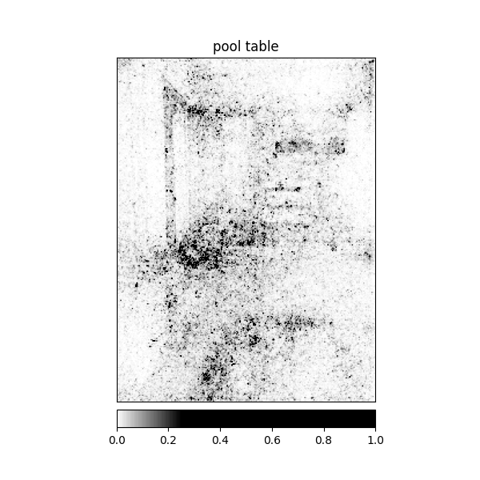
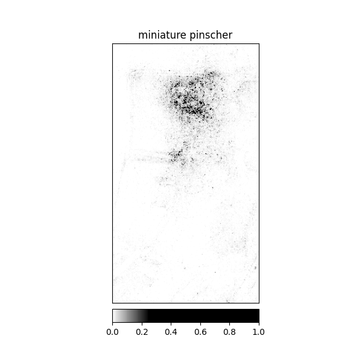
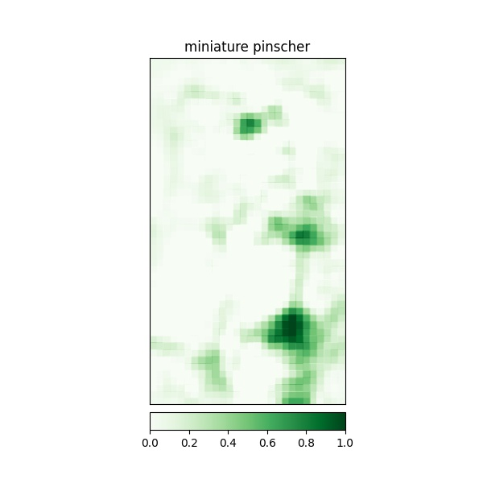
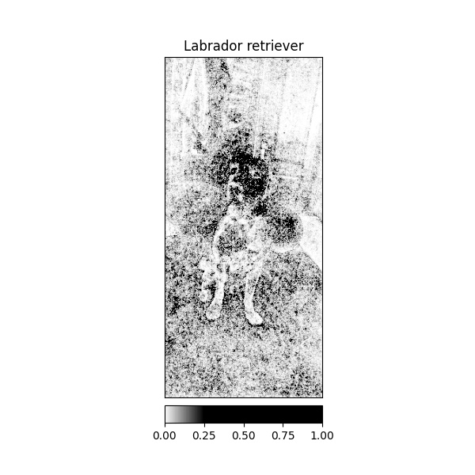
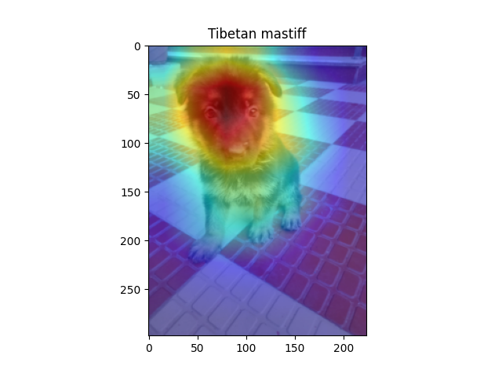
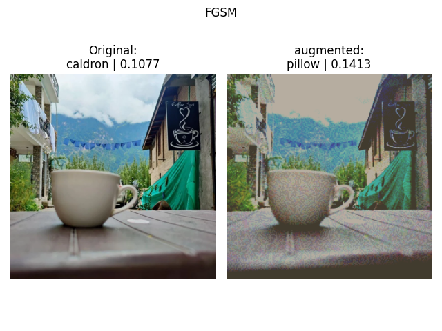
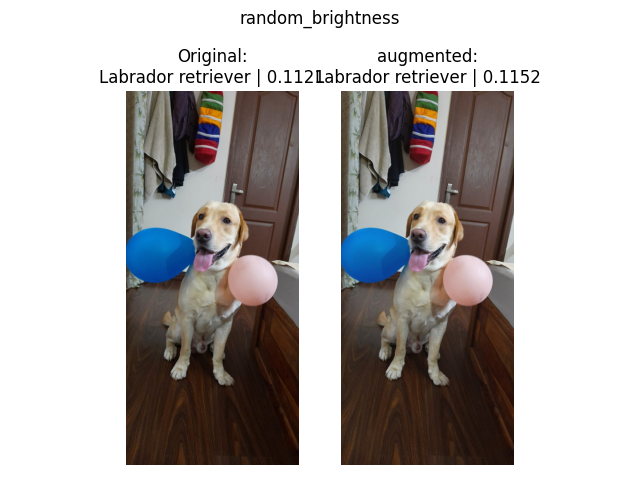

# TOC

- [TOC](#toc)
- [Assignment](#assignment)
- [Model Explanationability](#model-explanationability)
  - [Integrated Gradients](#integrated-gradients)
  - [Integrated Gradients with Noise](#integrated-gradients-with-noise)
  - [Saliency](#saliency)
  - [Occlusion](#occlusion)
  - [SHAP](#shap)
  - [GradCAM](#gradcam)
  - [GradCAM ++](#gradcam-)
- [Adversial Attacks wiht PGD](#adversial-attacks-wiht-pgd)
- [Model Robustness](#model-robustness)
# Assignment

1. Use Pretrained Models from TIMM (take models with larger input)
2. Do ALL the following for any 10 images taken by you (must be a class from ImageNet)
   1. Model Explanation with
      1. IG
      2. IG w/ Noise Tunnel
      3. Saliency
      4. Occlusion
      5. SHAP
      6. GradCAM
      7. GradCAM++
   2. Use PGD to make the model predict cat for all images
      1. save the images that made it predict cat
      2. add these images to the markdown file in your github repository
   3. Model Robustness with
      1. Pixel Dropout
      2. FGSM
      3. Random Noise
      4. Random Brightness 
    HINT: you can use https://albumentations.ai/ .for more image perturbations
3. Integrate above things into your pytorch lightning template
   1. create explain.py that will do all the model explanations
   2. create robustness.py to check for model robustness
4. Create a EXPLAINABILITY.md in log book folder of your repository
   1. Add the results (plots) of all the above things you’ve done
5. Submit link to EXPLAINABILITY.md in your github repository

` python src/explain.py source=images/test_images/ explainability=occlusion`

`python src/attacker.py source=images/test_images/`

`python src/robustness.py source=images/test_images/`

# Model Explanationability

we will use algorithms in [captum](https://captum.ai/docs/attribution_algorithms)

<h3>examples images (these are my dogs 😁)</h3>

    
    
    
    
    
    
    
    
    
    
    
    
    
    
    

## Integrated Gradients

-   https://captum.ai/docs/extension/integrated_gradients

    
    
    
    
    
    
    
    
    
    
    
    
    
    
    

## Integrated Gradients with Noise

- https://captum.ai/api/noise_tunnel.html

    
    
    
    
    
    
    
    
    
    
    
    
    
    
    

## Saliency

- https://captum.ai/api/saliency.html

    
    
    
    
    
    
    
    
    
    
    
    
    
    
    

## Occlusion

- https://captum.ai/api/occlusion.html

    
    
    
    
    
    
    
    
    
    
    
    
    
    
    

## SHAP

- https://captum.ai/api/gradient_shap.html

    
    
    
    
    
    
    
    
    
    
    
    
    
    
    

- https://github.com/jacobgil/pytorch-grad-cam
## GradCAM

    
    
    
    
    
    
    
    
    
    
    
    
    
    
    

## GradCAM ++

    
    
    
    
    
    
    
    
    
    
    
    
    
    
    

# Adversial Attacks wiht PGD

we will use [pgd](https://arxiv.org/abs/1706.06083) to predict every class as tiger cat

- https://captum.ai/api/robust.html

    
    
    
    
    
    
    
    
    
    
    
    
    
    
    

# Model Robustness

    
    
    
    

    
    
    
    

    
    
    
    

    
    
    
    

    
    
    
    

    
    
    
    

    
    
    
    

    
    
    
    

    
    
    
    

    
    
    
    

    
    
    
    

    
    
    
    

    
    
    
    

    
    
    
    

